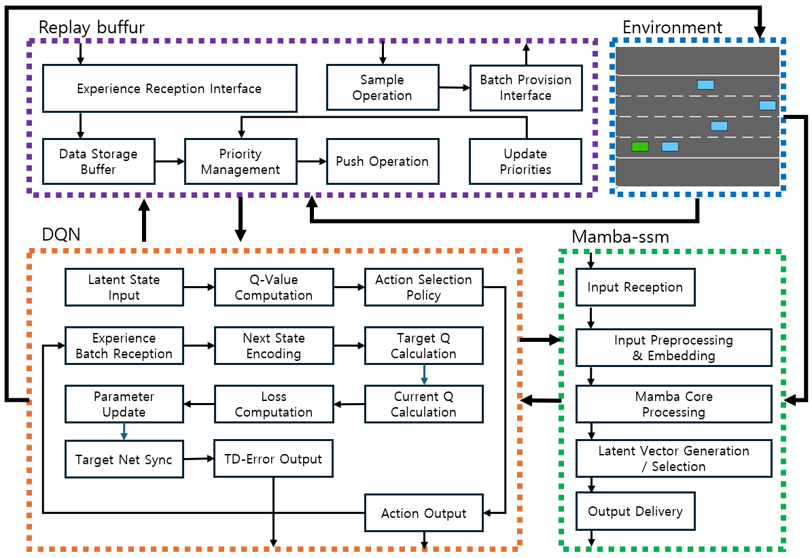
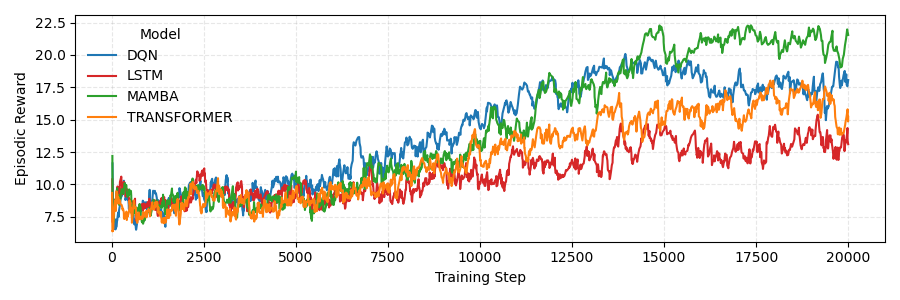
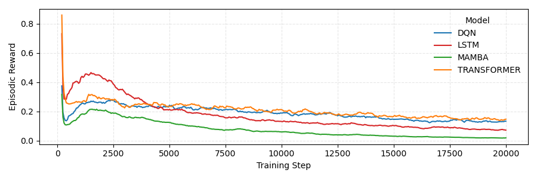
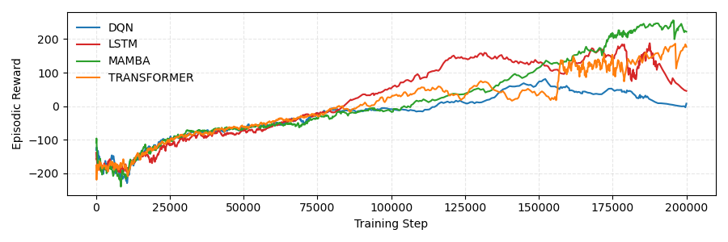
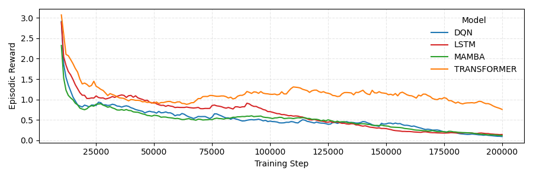

# Mamba
> **Mamba: Linear-Time Sequence Modeling with Selective State Spaces**\
> Albert Gu*, Tri Dao*\
> Paper: https://arxiv.org/abs/2312.00752

> **Transformers are SSMs: Generalized Models and Efficient Algorithms**\
>     **Through Structured State Space Duality**\
> Tri Dao*, Albert Gu*\
> Paper: https://arxiv.org/abs/2405.21060

--
## About

Mamba is a new state space model architecture showing promising performance on information-dense data such as language modeling, where previous subquadratic models fall short of Transformers.
It is based on the line of progress on [structured state space models](https://github.com/state-spaces/s4),
with an efficient hardware-aware design and implementation in the spirit of [FlashAttention](https://github.com/Dao-AILab/flash-attention).

## Installation

- [Optional] `pip install causal-conv1d>=1.4.0`: Efficient implementation of a causal Conv1d layer used inside the Mamba block.
- `pip install mamba-ssm`: Install the core Mamba package.
- `pip install mamba-ssm[causal-conv1d]`: Install the core Mamba package along with causal-conv1d.
- `pip install mamba-ssm[dev]`: Install the core Mamba package with development dependencies.

Alternatively, you can clone the official [mamba-ssm GitHub repository](https://github.com/state-spaces/mamba) and install it manually:

```bash
git clone https://github.com/state-spaces/mamba.git
cd mamba
pip install .


Try passing `--no-build-isolation` to `pip` if installation encounters difficulties either when building from source or installing from PyPi. Common `pip` complaints that can be resolved in this way include PyTorch versions, but other cases exist as well.

Other requirements:
- Linux
- NVIDIA GPU
- PyTorch 1.12+
- CUDA 11.6+

For AMD cards, see additional prerequisites below.

# Latent Mamba-DQN: Improving Temporal Dependency Modeling in Deep Q-Learning via Selective State Summarization

## Overview

This repository provides the official implementation of **Latent Mamba-DQN**, a Deep Q-Learning framework enhanced with Mamba-SSM for efficient temporal dependency modeling, selective state summarization, and improved policy stability in dynamic environments.

The associated publication is currently under preparation for peer-reviewed journal submission. This repository will be updated with the DOI and publication details upon acceptance.

> **Latent Mamba-DQN: Improving Temporal Dependency Modeling in Deep Q-Learning via Selective State Summarization**  

---

## 1. Architecture Overview

Latent Mamba-DQN integrates a **Mamba-based State Space Model (Mamba-SSM)** into the DQN framework to effectively capture temporal information from sequential observations. The proposed model processes state sequences through an MLP layer, followed by Mamba layers for time-dependent feature extraction. A latent vector summarizing temporal dynamics is then utilized to estimate Q-values.

Additionally, we extend the **Prioritized Experience Replay (PER)** mechanism to store and reuse latent representations, improving learning efficiency and policy stability.



---

## 2. Experimental Results

All experiments were conducted to identify optimal hyperparameter configurations for each environment. Consistent replay buffer structures were maintained to ensure reliable and reproducible evaluation of Latent Mamba-DQN.

### 2.1 Highway-fast-v0 Environment (Dynamic Control Task)

**Latent Mamba-DQN Performance (Smoothed Results, Averaged over 5 seeds):**

| Clipping | Avg. Smoothed Reward | Avg. Smoothed TD Loss |
|----------|----------------------|-----------------------|
| 1.0      | 17.52                | 0.0207                |
| 0.5      | **20.99**            | **0.0207**            |
| 0.1      | 20.06                | 0.0215                |

**Key Findings:**
- Latent Mamba-DQN achieves high average reward and low TD Loss across all gradient clipping settings.
- Stable convergence and reduced loss indicate improved learning robustness and policy consistency.

*Note:* Baseline models were also evaluated using their independently optimized hyperparameters to ensure fair performance comparison.

---

### 2.2 LunarLander-v3 Environment (Sparse Reward Task)

**Latent Mamba-DQN Performance (Fixed Clipping = 1.0):**

| Avg. Smoothed Reward | Avg. Smoothed TD Loss |
|----------------------|-----------------------|
| **224.68**           | 0.1183                |

**Observations:**
- Latent Mamba-DQN shows rapid reward increase during early training and stable convergence near 200 reward after approximately 175,000 steps.

*The corresponding academic paper is currently under preparation but has not yet been accepted for publication. This repository will be updated with the DOI and publication details if the paper is accepted. Until then, please contact the corresponding author for detailed experimental results or additional information.*

---

## 3. Convergence Graphs
### 3.1 Highway-fast-v0 Environment

The following graphs illustrate the learning dynamics of Latent Mamba-DQN in the Highway-fast-v0 environment. All results represent the average of 5 independent training runs, each performed with a different random seed to ensure statistical validity and robustness.

- **Top:** Smoothed Total Reward over training steps  
- **Bottom:** Smoothed TD Loss over training steps  





---

### 3.2 LunarLander-v3 Environment

The following graphs visualize the convergence behavior of Latent Mamba-DQN in the LunarLander-v3 environment. All results are averaged over 5 independent training runs, where each run was executed under a different random seed setting to ensure reliable evaluation.

- **Top:** Smoothed Total Reward trajectory  
- **Bottom:** Smoothed TD Loss trajectory  






*All reported results are averaged over 5 independent seeds with a smoothing coefficient of 0.9 applied to reward and loss curves.*

---

## 4. Acknowledgements

We would like to thank the developers of the following open-source environments, which were essential for the experimental validation of Latent Mamba-DQN:

- [HighwayEnv](https://github.com/Farama-Foundation/HighwayEnv): A high-speed autonomous driving simulation environment for dynamic control tasks.
- [LunarLander-v3](https://gymnasium.farama.org/environments/box2d/lunar_lander/): A classic control environment for sparse-reward landing tasks.

Their contributions to the research community made this work possible.

---
