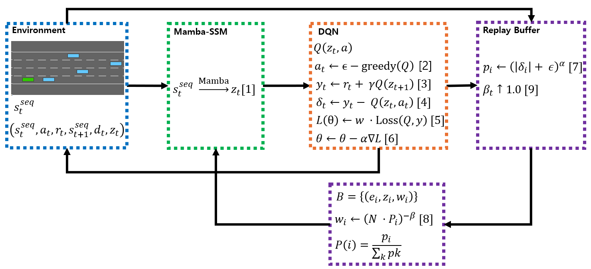

# Mamba
> **Mamba: Linear-Time Sequence Modeling with Selective State Spaces**\
> Albert Gu*, Tri Dao*\
> Paper: https://arxiv.org/abs/2312.00752

> **Transformers are SSMs: Generalized Models and Efficient Algorithms**\
>     **Through Structured State Space Duality**\
> Tri Dao*, Albert Gu*\
> Paper: https://arxiv.org/abs/2405.21060

## About

Mamba is a new state space model architecture showing promising performance on information-dense data such as language modeling, where previous subquadratic models fall short of Transformers.
It is based on the line of progress on [structured state space models](https://github.com/state-spaces/s4),
with an efficient hardware-aware design and implementation in the spirit of [FlashAttention](https://github.com/Dao-AILab/flash-attention).

## Installation

- [Option] `pip install causal-conv1d>=1.4.0`: an efficient implementation of a simple causal Conv1d layer used inside the Mamba block.
- `pip install mamba-ssm`: the core Mamba package.
- `pip install mamba-ssm[causal-conv1d]`: To install core Mamba package and causal-conv1d.
- `pip install mamba-ssm[dev]`: To install core Mamba package and dev depdencies.

It can also be built from source with `pip install .` from this repository.

Try passing `--no-build-isolation` to `pip` if installation encounters difficulties either when building from source or installing from PyPi. Common `pip` complaints that can be resolved in this way include PyTorch versions, but other cases exist as well.

Other requirements:
- Linux
- NVIDIA GPU
- PyTorch 1.12+
- CUDA 11.6+

For AMD cards, see additional prerequisites below.

# Latent Mamba-DQN: Improving Temporal Dependency Modeling in Deep Q-Learning via Selective State Summarization

## Overview

This repository provides the official implementation of **Latent Mamba-DQN**, a Deep Q-Learning framework enhanced with Mamba-SSM for efficient temporal dependency modeling, selective state summarization, and improved policy stability in dynamic environments.

The associated publication is currently under preparation for peer-reviewed journal submission. This repository will be updated with the DOI and publication details upon acceptance.

> **Latent Mamba-DQN: Improving Temporal Dependency Modeling in Deep Q-Learning via Selective State Summarization**  

## 1. Architecture Overview

Latent Mamba-DQN integrates a **Mamba-based State Space Model (Mamba-SSM)** into the DQN framework to effectively capture temporal information from sequential observations. The proposed model processes state sequences through an MLP layer, followed by Mamba layers for time-dependent feature extraction. A latent vector summarizing temporal dynamics is then utilized to estimate Q-values.

Additionally, we extend the **Prioritized Experience Replay (PER)** mechanism to store and reuse latent representations for efficient learning.

---

